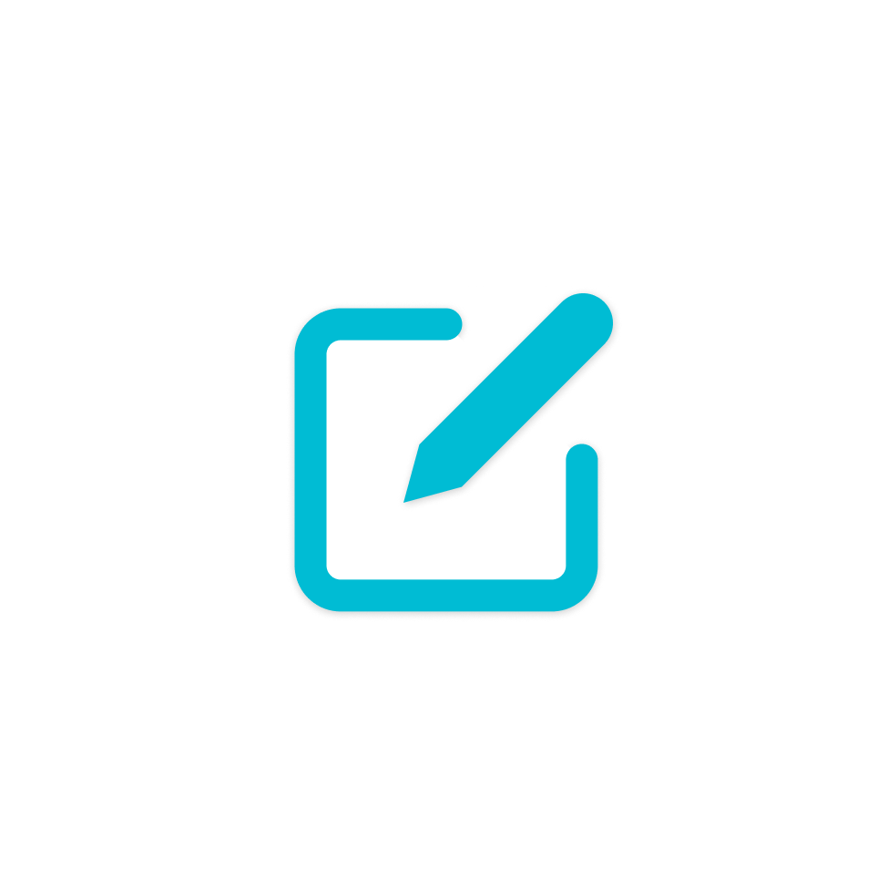

  

A fully open-source, end-to-end encrypted note-taking app with seamless cloud
sync.

# Note Safe – Your Ultimate Private Note-Taking App

Note Safe is a secure, open-source note-taking application designed for privacy
and reliability. Built with a local-first approach, it works offline, allowing
you to backup and restore your data at any time. Note Safe supports all types of
multi-media notes with seamless cloud sync for effortless cross-device access.

What makes Note Safe truly special is its strong cryptographic security, powered
by Libsodium APIs—a widely respected, modern, and high-performance encryption
library used in cutting-edge cryptographic applications. Libsodium offers
end-to-end encryption, meaning only you can access your data, and no one—not
even the cloud provider—can decrypt your notes.

With Supabase as the backend and a single Flutter codebase for cross-platform
compatibility, Note Safe delivers a smooth, reliable, and highly secure
note-taking experience across all devices.

 

 

## Security

If you believe you have found a security vulnerability, please email us at
[getphonesafe@gmail.com](mailto:getphonesafe@gmail.com) instead of opening a new
issue.
